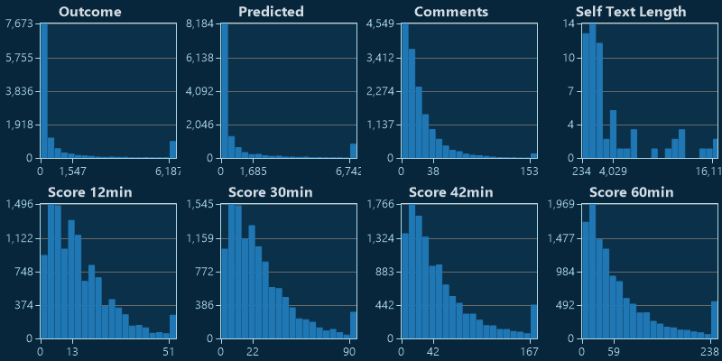
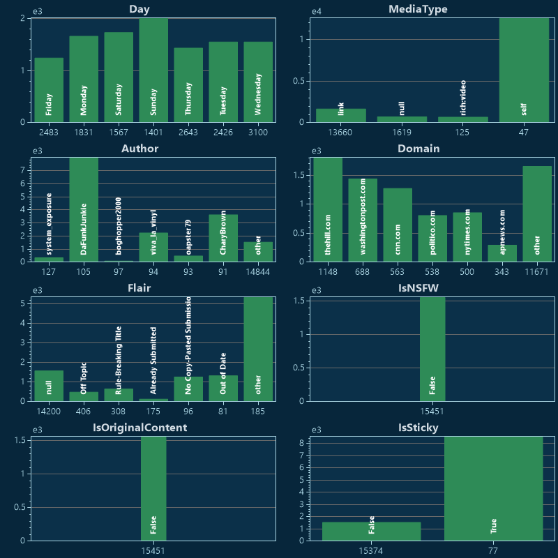
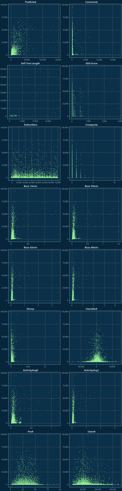

# r/politics

[Home](../index.md)

## Models

|Model|Trainer|n|R²|
|:---|:---|---:|---:|
|[General](models/guess_politics_General.md)|FastTreeTweedieRegression|5,354|0.61|
|[DropAuthor_N+1](models/guess_politics_DropAuthor_N+1.md)|FastTreeTweedieRegression|5,354|0.61|
|[DropAuthor](models/guess_politics_DropAuthor.md)|FastTreeTweedieRegression|3,271|0.64|
|[DropTitle](models/guess_politics_DropTitle.md)|FastTreeTweedieRegression|3,271|0.62|
|[AutoML](models/guess_politics_AutoML.md)|FastTreeTweedieRegression|2,472|0.60|
|[Observe2](models/guess_politics_Observe2.md)|FastTreeTweedieTrainer|6,307|0.78|
|[Observe10](models/guess_politics_Observe10.md)|FastTreeTweedieTrainer|4,695|0.74|
|[Observe5](models/guess_politics_Observe5.md)|FastTreeTweedieTrainer|4,214|0.78|
|[Observe1](models/guess_politics_Observe1.md)|FastTreeTweedieTrainer|4,160|0.77|
|[Prototype](models/guess_politics_Prototype.md)||0|0.00|

## Subreddit Charts

