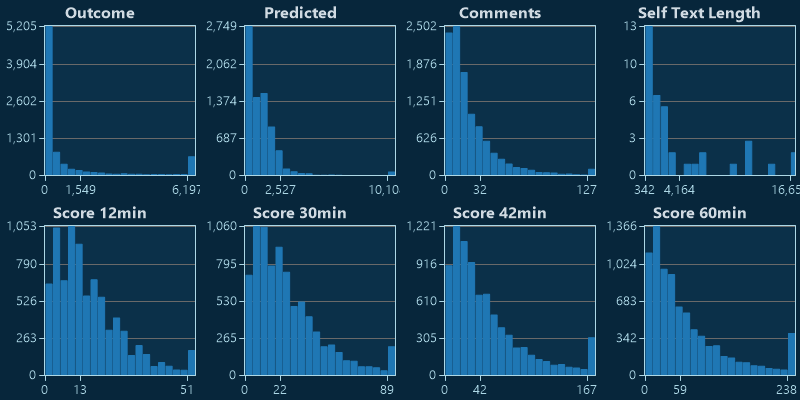
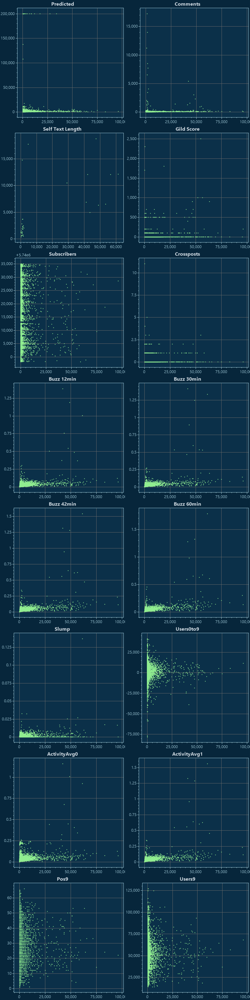

# r/politics

[Home](../index.md)

## Models

|Model|Trainer|n|R²|
|:---|:---|---:|---:|
|[General](models/hunch_politics_General.md)|FastTreeRegression|9,377|0.20|
|[DropAuthor_N+1](models/hunch_politics_DropAuthor_N+1.md)|FastTreeRegression|9,377|0.20|
|[DropAuthor](models/hunch_politics_DropAuthor.md)|FastTreeTweedieRegression|7,294|0.15|
|[DropTitle](models/hunch_politics_DropTitle.md)|FastTreeTweedieRegression|7,294|0.18|
|[RawData](models/hunch_politics_RawData.md)|FastTreeTweedieRegression|6,495|0.18|
|[Full](models/hunch_politics_Full.md)|SdcaRegressionTrainer|4,160|0.11|
|[Prototype](models/hunch_politics_Prototype.md)||0|0.00|

## Subreddit Charts

